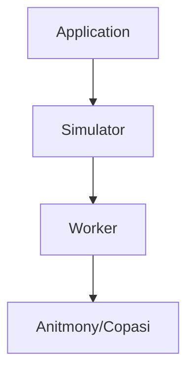

`libantimony`, `copasijs`, `libsbmlsim` have been vendored in the `src/vendor` directory.

Note, that `copasi.d.ts` types have been modified to work better.

I have forks for the libraries compiled without the `SINGLE_FILE` flag and with the `EXPORT_ES6` flag here:

- https://github.com/qndan/libantimonyjs-es6 (you have to go in the Actions tab and look at the build artifact to get the files)
- https://github.com/qndan/COPASI.js-es6 (still working on the github workflow for this one)
- https://github.com/qndan/libsbmlsim-wasm

I made the WASM files separate because I don't want giant JS files. If you want to update the dependencies, you should re-compile without `-sSINGLE_FILE` and
with `-sEXPORT_ES6` then just dump the files in `src/vendor/`.

Make sure to update all the vendored files to use ES6 exports (`export ...` instead of `modules.export`) so Vite works properly.

Application code interfaces with a Simulator class. This Simulator class manages a [Web Worker](https://developer.mozilla.org/en-US/docs/Web/API/Web_Workers_API/Using_web_workers). The Web Worker calls the Antimony/Copasi APIs directly.

When you want to add a new simulation feature, you will likely have to edit multiple files. Here are places to look:

- `src/globals/simulation + src/globals/model` - these contain the Simulator instance and other various information about the model the user is typing.
- `src/features/Simulator` - the Simulator interface. As of now, the only implementation is in `src/features/CopasiSimulator`.

## worker interface

Workers are managed by `WorkerPool` in `src/features/taskPool.ts`.

Workers are expected to send messages in a specific format which you can take a look at in that file (look for the `Action`, `Result`, and `ErrorResult` types).
