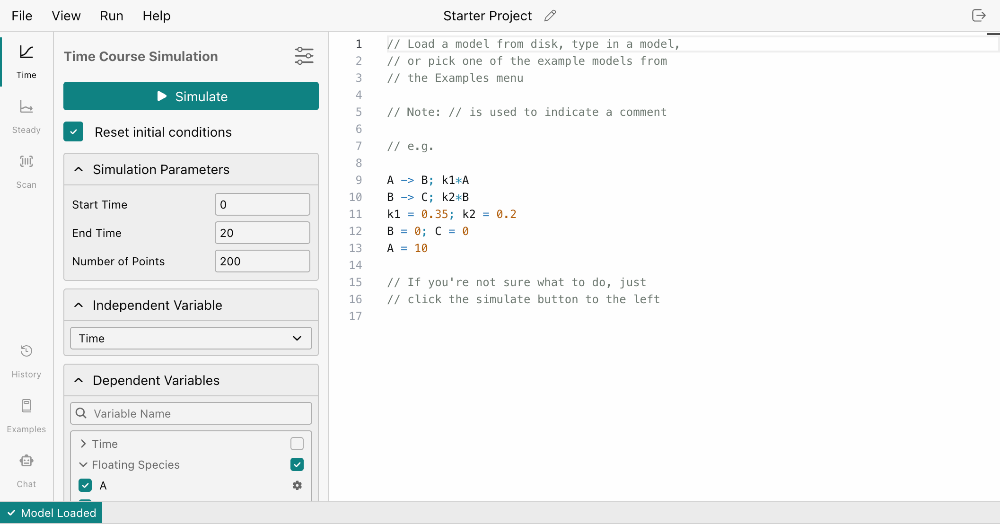
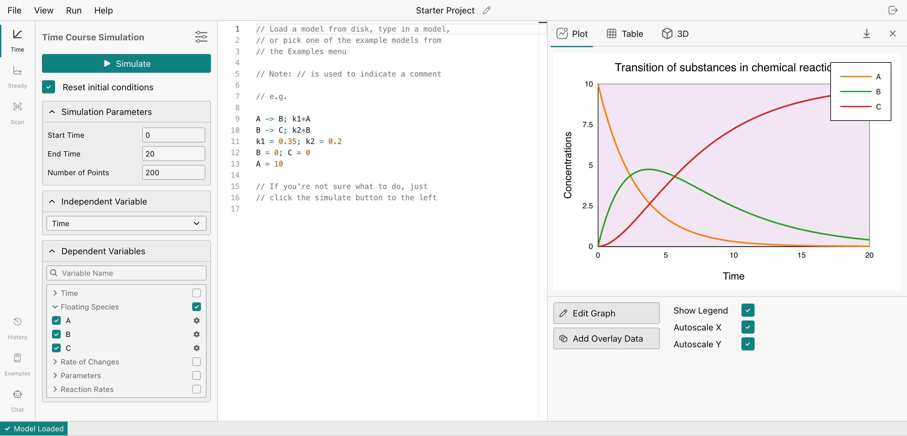
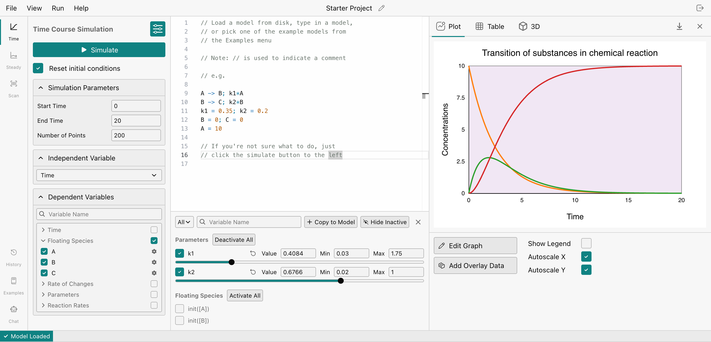

# Getting Started

You can access WebIridium immediately via the URL: [https://sys-bio.github.io/WebIridium/](https://sys-bio.github.io/WebIridium/).

In this section, we'll be creating a model, simulating it, searching for interesting configurations, and then saving them.

## Making Your First Project

The first screen is the *Projects* page. On the left, you'll see a list of projects you have created. On the right is a list of models pulled from [https://biomodels.org/](https://biomodels.org/). Pressing one of these will automatically generate a project from the corresponding biomodel.

Press the button near the top center that says "New Project."

This will create a new project and open it. Now you should see something like this:

On the left is the simulation panel. We can use this to run a time course simulation. On the right is the Antimony code for our model. We will not cover how to use Antimony in this manual, but you can learn more about it here: [https://tellurium.readthedocs.io/en/latest/antimony.html](https://tellurium.readthedocs.io/en/latest/antimony.html).

## Running a Simulation

Press the large teal "Simulate" button to run your simulation. This will start a time course simulation.

It may take a few seconds at first as WebIridium loads the simulator.

Once the simulation is done, a graph should appear on the right:

Congratulations, you have run your first time course simulation on WebIridium!

## Loading Examples

On the bottom-left is a panel named *Examples*. You can explore different types of models via this panel. Try out different ones, and pick one you think is interesting.

## Using Sliders

One of the main features of WebIridium is are the *sliders*. Sliders allow us to change the parameters and initial conditions of our model without having to edit our code then press simulate, and do this over and over again every time we want to change a value.

Open the Sliders menu by pressing the  sliders icon at the top of the simulation panel. This should open a menu in the center-bottom with an array of sliders.

By default, all sliders are disabled so they don't affect your model unexpectedly. Press "Activate All" next to the "Parameters" subheading to activate the sliders for "k1" and "k2."

You can start dragging the sliders and the changes should reflect immediately in the graph to the right. Try doing this until you find something interesting.

Once you have found an interesting combination of parameters, you can press the "Copy to Model" button in the top-right of the sliders panel to save the values as a comment into your code. You will then be able to load these parameters back into your sliders by pressing the "Load Parameter Set" option which should appear right above the comment.

You can download your graph to share by pressing the  download icon to the top-right of the graph. You can download your Antimony code by pressing `File > Download as Antimony` in the top-left.

## Finishing Up

Now that you are done, it's time to close your project.

In the top-right you will see an exit icon. Press it twice to close your project. You will return to the projects page.

Since projects in WebIridium auto-save, you don't have to worry about losing your progress. You can close or refresh your tab at any time, and everything will be right where you left it.

## Next Steps

These are the basics of WebIridium, but there are many more features to explore. Try poking around the UI for anything that might be useful to you.

If you have any specific questions about how a feature works or how to use it, you can use the following sections of this manual as a reference. Take advantage of the search feature as well!

> [!NOTE]
> The rest of the manual is still being written.